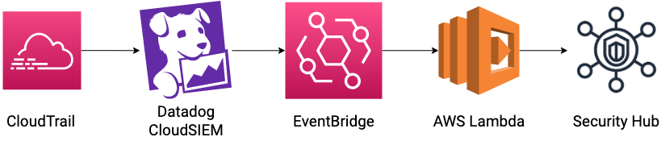
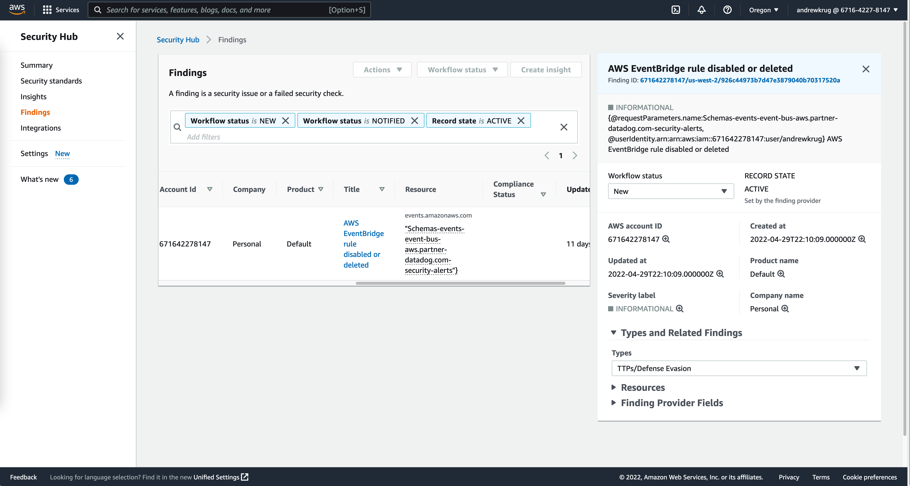

# Datadog Security Hub Integration

This quick start enables customers of Datadog's security platform to send security signals from Datadog to [AWS Security Hub](https://aws.amazon.com/security-hub/). It uses CloudFormation, an accompanying Lambda function, and  Datadog's integration with Eventbridge to create a one-way integration from Datadog's security products to AWS Security Hub.

If you would like to send security alerts from AWS Security Hub to Datadog, you should isntead follow [these steps](https://docs.datadoghq.com/integrations/amazon_security_hub/).

## Architecture Diagram

  

## Prerequisites

1. `jq` installed on your command line
2. Valid AWS credentials capable of deploying this project
3. AWS SAM ([Serverless Application Model CLI](https://docs.aws.amazon.com/serverless-application-model/latest/developerguide/serverless-sam-cli-install.html))

## Deployment

1. Configure the Datadog Event Bridge Integration. Documentation exists for this [here](https://docs.datadoghq.com/integrations/amazon_event_bridge/).
2. In Datadog, create a [security notification rule](https://docs.datadoghq.com/security_platform/notification_rules/) naming @awseventbridge-YOUR_BRIDGE_NAME as the destination.
3. Deploy SAM template.  You'll need to provide the EventBridge bus name and the ARN of your SecurityHub.

> SecurityHub ARNs can be found by running `aws securityhub describe-hub | jq .HubArn` in the region that you'd like to aggregate all Datadog findings in.

## Usage

The prototype will ship findings from Datadog to SecurityHub which contain the tag: `iaas:aws`.
Any other custom alerts can be sent as well by adding the tag `securityhub`.

## Result
Example Datadog security signal viewed in AWS Security Hub:

  

## Developer Guide 

### Testing

1. Run `make build` _This builds the testing docker container_
2. Run `make test`
3. Prior to committing code please format using `make format`

### License

This project is licensed under the Apache 2 License